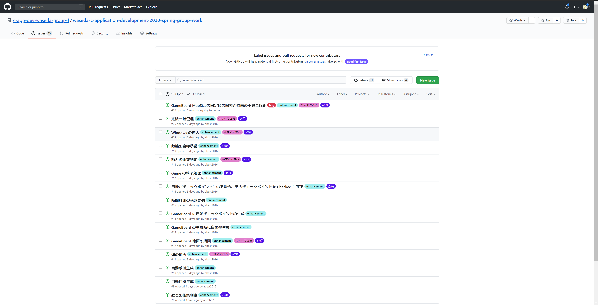

# 早稲田大学 C アプリケーションデベロップメント 2020 グループワーク関係資料

## お願い 🙇

`Master` ブランチを直接に弄るだけは絶対にしないでいただきたいです。その理由は

1. 変更箇所が分からなくなります。
1. 万が一問題のあるコードを入れると危険です。
1. 他に `Master` をベースとしているブランチがあったら予想外の問題が生じる恐れがあります。

基本的に下記の作業の流れが考えられます。

1. `Master` ブランチから新しいブランチを作成

1. そのブランチ内に作業
1. みんなに確認を依頼
1. `Master` ブランチに Merge

## タスク開始から完了までの流れ
1.  GitHubのissuesからタスク一覧を確認します。

1. できそうなタスクをクリックしてissueのページに移動します。内容を確認したら、Assignees
から担当者を自分に設定します。

1. 自分のPCで作業をしていきます。(画像はコマンドラインを使う場合)
    1. masterブランチにいることを確認します。
    1. git pullしてmasterを最新のものに更新します。
    1. 自分の担当するissueに合わせてブランチを切ります。
    1. 自分のブランチでコード編集、コンパイル、動作確認をします。
    1. 問題なく動くことを確認したら、git add(変更したファイルの登録)、git commit(変更内容にコメントを付ける、#issue番号を書くのを忘れずに)します。
    1. git push(GitHubへのファイルのアップロード)をします。

1. GitHubでPull Request（＝他の人への確認依頼）を送ります。Pull requestsタブからCompare & pull requestを選択します。

1. 右上のReviewersから確認してもらいたい人を選択して、Create pull request。

1. 確認してもらってOKが出ると、Squash and mergeが押せるようになるのでこれを押してmerge(masterブランチに自分の作業を反映すること)して作業完了です。
